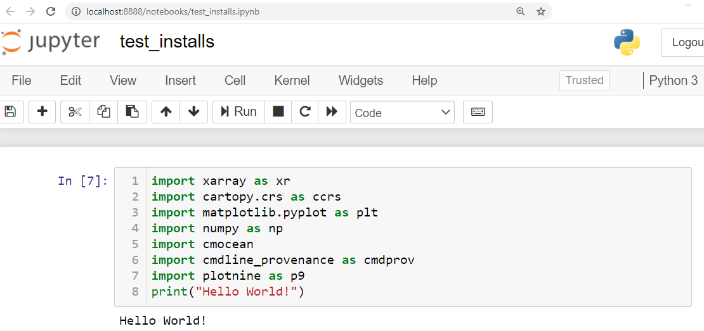

 See instructions in the comments below for how to edit specific sections of this workshop template. 


HEADER

Edit the values in the block above to be appropriate for your workshop.
If the value is not 'true', 'false', 'null', or a number, please use
double quotation marks around the value, unless specified otherwise.
And run 'make workshop-check' *before* committing to make sure that changes are good.



8< ============= For a workshop delete from here =============
For a workshop please delete the following block until the next dashed-line

This is the workshop template. Delete these lines and use it to
<a href="https://carpentries.github.io/workshop-template/customization/index.html">customize</a>
your own website. If you are running a self-organized workshop or have not put
in a workshop request yet, please also fill in
<a href="{{site.amy_site}}/forms/self-organised/">this workshop request form</a>
to let us know about your workshop and our administrator may contact you if we
need any extra information.




8< ============================= until here ==================



Check DC curriculum





It looks like you are setting up a website for a Data Carpentry curriculum but you haven't specified the curriculum type in the <code>_config.yml</code> file (current value in <code>_config.yml</code>: "<strong>{{ site.curriculum }}</strong>", possible values: <code>dc-ecology</code>, <code>dc-genomics</code>, <code>dc-socsci</code>, or <code>dc-geospatial</code>). After editing this file, you need to run <code>make serve</code> again to see the changes reflected.





Check SWC curriculum





It looks like you are setting up a website for a Software Carpentry curriculum but you haven't specified the curriculum type in the <code>_config.yml</code> file (current value in <code>_config.yml</code>: "<strong>{{ site.curriculum }}</strong>", possible values: <code>swc-inflammation</code>, or <code>swc-gapminder</code>). After editing this file, you need to run <code>make serve</code> again to see the changes reflected.





EVENTBRITE

This block includes the Eventbrite registration widget if
'eventbrite' has been set in the header.  You can delete it if you
are not using Eventbrite, or leave it in, since it will not be
displayed if the 'eventbrite' field in the header is not set.


<strong>Some adblockers block the registration window. If you do not see the
  registration box below, please check your adblocker settings.</strong>
<iframe
  src="https://www.eventbrite.com/tickets-external?eid={{page.eventbrite}}&ref=etckt"
  frameborder="0"
  width="100%"
  height="280px"
  scrolling="auto">
</iframe>


<h2 id="general">General Information</h2>


INTRODUCTION

Edit the general explanatory paragraph below if you want to change
the pitch.




LOCATION

This block displays the address and links to maps showing directions
if the latitude and longitude of the workshop have been set.  You
can use https://itouchmap.com/latlong.html to find the lat/long of an
address.











  <strong>Where:</strong>
  {{page.address}}.
  Get directions with
  <a href="//www.openstreetmap.org/?mlat={{page.latitude}}&mlon={{page.longitude}}&zoom=16">OpenStreetMap</a>
  or
  <a href="//maps.google.com/maps?q={{page.latitude}},{{page.longitude}}">Google Maps</a>.



  <strong>Where:</strong>
  online at <a href="{{page.address}}">{{page.address}}</a>.
  If you need a password or other information to access the training,
  the instructor will pass it on to you before the workshop.



  <strong>Where:</strong> This training will take place online.
  The instructors will provide you with the information you will need to connect to this meeting.




DATE

This block displays the date and links to Google Calendar.



  <strong>When:</strong>
  {{page.humandate}}.
  





AUDIENCE

Explain who your audience is.  (In particular, tell readers if the
workshop is only open to people from a particular institution.



  <strong>Audience:</strong>
This workshop is targeted towards the technical WHOI staff in order to improve project efficiency and build technical skills. It will only be held for 20 people at a time through an online Zoom meeting. Registration is required. Please contact stace@whoi.edu for availability. 

  <strong>Prerequisites:</strong>
To get the most out of this workshop we suggest that participants are already using python for data analysis at a novice or intermediate level.  A strong familiarity with Python syntax and basic constructs such as loops, lists and conditionals (i.e. if statements) is required. Python skills covered will progress from novice to intermediate over the course of the workshop.

  <strong>When:</strong> Four half-day, morning workshops on Mondays and Tuesdays. October 26th and 27th, November 2nd and 3rd.  Each day will start at 8:30AM and finish at 12:30PM.  Breaks will be included in the schedule.



SPECIAL REQUIREMENTS

Modify the block below if there are any special requirements.


  <strong>Requirements:</strong> Participants must bring a laptop with a
  Mac, Linux, or Windows operating system (not a tablet, Chromebook, etc.) that they have administrative privileges on. They should have a few specific software packages installed (listed <a href="#setup">below</a>).


ACCESSIBILITY

Modify the block below if there are any barriers to accessibility or
special instructions.


  <strong>Accessibility:</strong>

  We are committed to making this workshop
  accessible to everybody. The workshop organizers have checked that:

<ul>
  <li>The room is wheelchair / scooter accessible.</li>
  <li>Accessible restrooms are available.</li>
</ul>

  Materials will be provided in advance of the workshop and
  large-print handouts are available if needed by notifying the
  organizers in advance.  If we can help making learning easier for
  you (e.g. sign-language interpreters, lactation facilities) please
  get in touch (using contact details below) and we will
  attempt to provide them.

  We are dedicated to providing a positive and accessible learning environment for all. Please
  notify the instructors in advance of the workshop if you require any accommodations or if there is
  anything we can do to make this workshop more accessible to you.




CONTACT EMAIL ADDRESS

Display the contact email address set in the configuration file.


  <strong>Contact:</strong>
  Please email
  
  
  
  or
  
  
  ,
  
  
  <a href='mailto:{{email}}'>{{email}}</a>
  
  
  to-be-announced
  
  for more information.



  <strong>Roles:</strong>
  To learn more about the roles at the workshop (who will be doing what),
  refer to <a href="https://carpentries.org/workshop_faq/#what-are-the-roles-of-everyone-participating-in-a-workshop">our Workshop FAQ</a>.




WHO CAN ATTEND?

If you would like to specify who can attend the workshop,
you can use the section below.

Move the 'endcomment' tag above the beginning of the following

 tag to make this section visible.

Edit the text to match who can attend the workshop. For instance:
- This workshop is open to affiliates to ABC university.
- This workshop is open to the public.
- If you are interested in attending this workshop, contact me@example.com
  for more information

    <strong>Who can attend?:</strong>
    This workshop is open to ....



<strong>Workshop sponsorship: </strong> DDVPR Technical Staff Training Award

<h2 id="why">Why take this course? </h2>

<strong>We\'ll cover:</strong>
<ul>
  <li>Managing tabular data for analysis and reproducibility</li>
  <li>Improving python skills for data analysis, and visualisation, both for tabular and grdided data</li>
  <li>Introducing collaboration and versioning using github and jupyter notebooks.</li>
</ul>

<strong>Managing tabular data for analysis and reproducibility.</strong>

Good data organization is the foundation of any research project. Most researchers have data in spreadsheets, so it’s the place that many research projects start. 

We organize data in spreadsheets in the ways that we as humans want to work with the data, but computers require that data be organized in particular ways. In order to use       tools that make computation more efficient, such as programming languages like R or Python, we need to structure our data the way that computers need the data. Since this is where most research projects start, this is where we want to start too!  The concepts learned here also apply more broadly to other tabular formats (e.g. csv and tsv).

In this lesson, you will learn:
<ul>
  <li>Good data entry practices - formatting data tables in spreadsheets</li>
  <li>How to avoid common formatting mistakes</li>
  <li>Approaches for handling dates in spreadsheets</li>
  <li>Basic quality control and data manipulation in spreadsheets</li>
  <li>Exporting data from spreadsheets</li>
</ul>  

<strong>Improving python skills for data analysis and visualization.</strong>

Python is rapidly emerging as the programming language of choice for data  analysis in the atmosphere and ocean sciences. By consulting online tutorials and help pages, most researchers in this community are able to pick up the basic syntax and programming constructs (e.g. loops, lists and conditionals). This self-taught knowledge is sufficient to get work done, but it often involves spending hours to do things that should take minutes, reinventing a lot of wheels, and a nagging uncertainty at the end of it all regarding the reliability and reproducibility of the results. To help address these issues, these Data Carpentry lessons cover a suite of programming and data management best practices that aren’t so easy to glean from a quick Google search.

<strong>Introducing collaboration and versioning using github and jupyter notebooks.</strong>

We will be taking this to a next level, introducing tools to increase collaboration, ensure code provenance and lower mistakes with documentation, and use versioning to not save a thousand copies of your code.

<h2 id="about-data-carpentries">About Data Carpentries</h2>

<a href="https://datacarpentry.org/">Data Carpentry</a> develops and teaches workshops on the fundamental data skills needed to conduct research. Its lessons are domain specific, building on learners' existing knowledge to enable them to quickly apply skills learned to their own research. Participants will be encouraged to help one another and to apply what they have learned to their own research problems.

For more information on what we teach and why, please see our paper "<a href="http://journals.plos.org/ploscompbiol/article?id=10.1371/journal.pcbi.1005510">Good Enough Practices for Scientific Computing</a>".


CODE OF CONDUCT

<h2 id="code-of-conduct">Code of Conduct</h2>

Everyone who participates in Carpentries activities is required to conform to the <a href="https://docs.carpentries.org/topic_folders/policies/code-of-conduct.html">Code of Conduct</a>. This document also outlines how to report an incident if needed.

  <a href="https://goo.gl/forms/KoUfO53Za3apOuOK2">
    <button type="button" class="btn btn-info">Report a Code of Conduct Incident</button>
  </a>


Collaborative Notes

If you want to use an Etherpad, go to

https://pad.carpentries.org/YYYY-MM-DD-site

where 'YYYY-MM-DD-site' is the identifier for your workshop,
e.g., '2015-06-10-esu'.

Note we also have a CodiMD (the open-source version of HackMD)
available at https://codimd.carpentries.org


<h2 id="collaborative_notes">Collaborative Notes</h2>

We will use this <a href="{{ page.collaborative_notes }}">collaborative document</a> for chatting, taking notes, and sharing URLs and bits of code.




SURVEYS - DO NOT EDIT SURVEY LINKS

<h2 id="surveys">Surveys</h2>

Please be sure to complete these surveys before and after the workshop.

<a href="{{ site.pre_survey }}{{ site.github.project_title }}">Pre-workshop Survey</a>

<a href="{{ site.post_survey }}{{ site.github.project_title }}">Post-workshop Survey</a>


SCHEDULE

Show the workshop's schedule.  Edit the items and times in the table
to match your plans.  You may also want to change 'Day 1' and 'Day
2' to be actual dates or days of the week.

<h2 id="schedule">Schedule</h2>











<h2 id="schedule">Syllabus</h2>

This workshop is based on a few workshops developed by the Carpentries (See <a href="https://carpentries.org">https://carpentries.org</a>  for more information about the Carpentries organisation.) 
<ul>
  <li><a href=" https://datacarpentry.org/spreadsheet-ecology-lesson/">Data Organization in Spreadsheets for Ecologists</a></li>
  <li><a href="https://datacarpentry.org/python-ecology-lesson/">Data Analysis and Visualization for Ecologists</a></li>
  <li><a href="https://carpentrieslab.github.io/python-aos-lesson/">Python for atmosphere and ocean scientists</a></li>
</ul>

 

 

    

Show what topics will be covered.

1. If your workshop is R rather than Python, remove the comment
around that section and put a comment around the Python section.
2. Some workshops will delete SQL.
3. Please make sure the list of topics is synchronized with what you
intend to teach.
4. You may need to move the div's with class="col-md-6" around inside
the div's with class="row" to balance the multi-column layout.

This is one of the places where people frequently make mistakes, so
please preview your site before committing, and make sure to run
'tools/check' as well.

<h2 id="syllabus">Syllabus</h2>












SETUP

Delete irrelevant sections from the setup instructions.  Each
section is inside a 'div' without any classes to make the beginning
and end easier to find.

This is the other place where people frequently make mistakes, so
please preview your site before committing, and make sure to run
'tools/check' as well.


<h2 id="setup">Setup for Week 1 (Days 1 and 2)</h2>

  To participate in a
  
  Software Carpentry
  
  Data Carpentry
  
  Library Carpentry
  
  workshop, you will need access to the software described below (Zoom, Python, Jupyter notebooks). In addition you will need an up-to-date web browser and access access to a spreadsheet program (Excel, LibreOffice,...),

  We maintain a list of common issues that occur during installation as a reference for instructors that may be useful on the <a href = "{{site.swc_github}}/workshop-template/wiki/Configuration-Problems-and-Solutions">Configuration Problems and Solutions wiki page</a>.


For online workshops, the section below provides:
- installation instructions for the Zoom client
- recommendations for setting up Learners' workspace so they can follow along
  the instructions and the videoconferencing

If you do not use Zoom for your online workshop, edit the file
`_includes/install_instructions/videoconferencing.html`
to include the relevant installation instrucctions.







These are the installation instructions for the tools used
during the workshop.












<h2>Setup for Week 2 (Days 3 and 4)</h2>




<h3>Installing required packages</h3>

For the workshop we recommend installing the required packages using the Anaconda Prompt in windows (or Terminal in Mac/Linux) as described in method 1 (below). If you try method 2 and that does not work for you, you can try method 1 at any time since it uses a separate environment we create just for this lesson.

  <strong>Install method 1: Make a new environment and launch jupyter notebooks using the new environment.</strong>
  
This method is more fail-safe than method 2.   As shown in the steps below you have to use a command line (Anaconda Prompt(win) Terminal(Mac/Linux) to launch jupyter notebook, not the graphical Anaconda Navigator.

  <strong>Steps</strong>
  <ol>
    <li>Open Anaconda Prompt (Windows) or Terminal(Mac/Linux)</li>
    <li>
Enter the following command to create a new environment called "pyaos-lesson"

       <pre><code>conda create -n pyaos-lesson -c conda-forge jupyter xarray netCDF4 cartopy cmocean cmdline_provenance plotnine</code></pre>
    <li>
        
You will be asked if you would like to install the packages after they are found.  Press Yes (y).

        
You should see messages for Preparing, Verifying, and Executing the "transaction" and end with a line that says "done"

    </li>
    <li>
        
Enter the new environment you created.  After this command you should see "(pyaos-lesson)" at the start of your line.

        <pre><code>conda activate pyaos-lesson</code></pre>
    </li>
    <li>
        
Launch the jupyter notebook with the following command. A new browser window should pop up with jupyter notebook in it.

        <pre><code>jupyter notebook</code></pre></li>
    <li>Test your installs worked. See "Testing Your Installs" section Below.</li>
  </ol>

    <strong>Install Method 2: Using the base environment</strong>
    
This method may be quite slow for some people and you may encounter more issues than method 1. But if you have completed your installs with this method and your test works then you are all set for the worksohp (See "Testing Your Installs" section Below).

    <strong>Steps</strong>
    <ol>
      <li>Enter <code>conda activate base</code> and press enter to execute. This makes sure you are in your base environment. It won't hurt anything if you already are in base and run it anyway.  You should see "(base)" at the beginning of your line.</li>
      <li>
      Run the following commands one at a time.  It may take a few minutes to respond during this process.  You will be asked if you would like to install the packages after they are found.  Press Yes (y)
    
<code>conda install jupyter xarray netCDF4 cartopy</code>

    
<code>conda install -c conda-forge cmocean cmdline_provenance plotnine</code>

    
You should see messages for Preparing, Verifying, and Executing the "transaction" and end with a line that says "done"

      </li>
      <li>Launch the jupyter nootebook using either Anaconda Navigator or command line using Anaconda Prompt(Windows) or Terminal(Mac/Linux).</li>
      <li>Test your installs worked. See "Testing Your Installs" section Below.</li>
    </ol>

  
<h3>Testing your installs</h3>

To check your install was successful and you can use the packages within a notebook, you can enter the following into a jupyter notebook cell and run it. You should be able to execute the cell without an error.  It may take a few seconds then will show you "Hello World!" after the cell.

<pre><code>import xarray as xr
import cartopy.crs as ccrs
import matplotlib.pyplot as plt
import numpy as np
import cmocean
import cmdline_provenance as cmdprov
import plotnine as p9
import pandas as pd
print("Hello World!")
</code></pre>
 

  <h3>Launching Jupyter Notebook</h3>
  
*if you have just followed the instructions to install packages and test them, you already have launched jupyter notebook and can use that.  You can follow these instructions if you don't already have a notebook running.

  <strong>Steps</strong>
  <ol>
    <li> Open an Anaconda Prompt(Win) or Terminal(Mac/Linux) and type the command "jupyter notebook". </li>
    <li>
Enter the environment wish to use.  After this command you should see the environment name "(pyaos-lesson)"  or "base" at the start of your line.

      

If you installed your packages using method 1:

            <pre><code>conda activate pyaos-lesson</code></pre>
     

      

If you installed your packages using method 2:

        <pre><code>conda activate base</code></pre> 
        
     

    </li>
    <li>
Launch the jupyter notebook with the following command. A new browser window should pop up right into your notebook.

     <pre><code>jupyter notebook</code></pre>
     
A browser window will open with your notebook in it. If you close the page and need to get back to it, you can copy and paste the link shown in your Anaconda Prompt/Terminal.  Or you can try the default address <a href="http://localhost:8888/">http://localhost:8888/</a>.
     </li>
  
  </ol>
  

For a brief introduction to Jupyter Notebooks, please consult our <a href="https://datacarpentry.org/python-ecology-lesson/jupyter_notebooks/">Introduction to Jupyter Notebooks</a> page. If you installed your required packages using method 2, you can also launch jupyter notebook using the Anaconda Navigator (instead of command line) as shown in that lesson.

<h3>Data</h3>

In preparation for these lessons,you will need to download the following two Python scripts and four netCDF files
and place them in a new folder/directory:

<ol>
  <li>Make a new folder in your Desktop called `data-carpentry` if you haven't already.</li>
  <li>Download <a href="https://carpentrieslab.github.io/python-aos-lesson/code/script_template.py">script_template.py</a> and <a href="https://carpentrieslab.github.io/python-aos-lesson/code/plot_precipitation_climatology.py">plot_precipitation_climatology.py</a> and move them into that folder.</li>
  <li>Make a new folder in your `data-carpentry` folder called `data` if you haven't already.</li>
  <li>Download the following files and place them in that folder:</li>
   <ul>
     <li><a href="https://carpentrieslab.github.io/python-aos-lesson/data/pr_Amon_ACCESS1-3_historical_r1i1p1_200101-200512.nc">pr_access_file</a></li>
     <li><a href="https://carpentrieslab.github.io/python-aos-lesson/data/pr_Amon_CSIRO-Mk3-6-0_historical_r1i1p1_200101-200512.nc">pr_csiro_file</a></li>
     <li><a href="https://carpentrieslab.github.io/python-aos-lesson/data/sftlf_fx_ACCESS1-3_historical_r0i0p0.nc">sftlf_access_file</a></li>
     <li><a href="https://carpentrieslab.github.io/python-aos-lesson/data/sftlf_fx_CSIRO-Mk3-6-0_historical_r0i0p0.nc">sftlf_csiro_file</a></li>
  </ul>
</ol>

